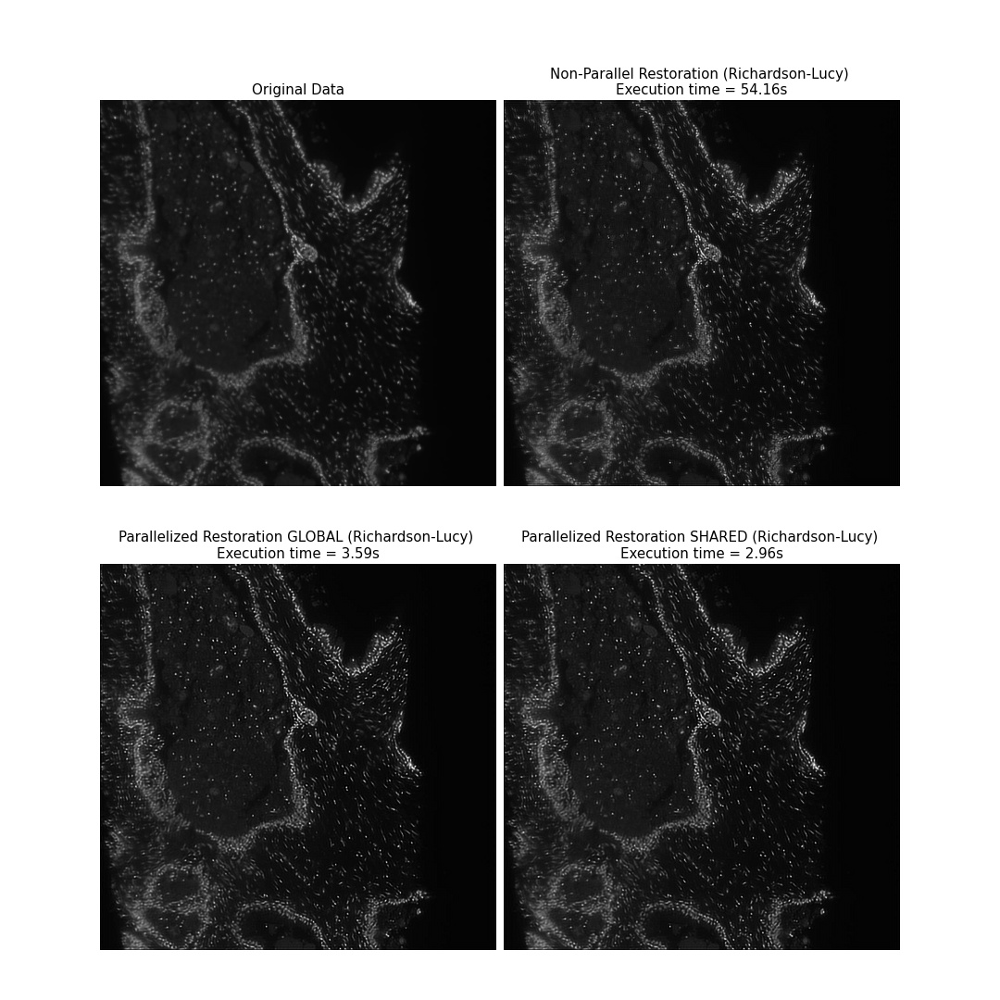

# Image Deconvolution for Biomedical Microscopy

This project provides a notebook and functions for image deconvolution with a CUDA implementation of Richardson Lucy Deconvolution algorithm[^1]

## Background

Open-top light-sheet (OTLS) microscopy can provide comprehensive imaging with high quality. However, the image can be convoluted or distorted because of limitation of microscope system. In that case, the specimen appears blurry or out of focus which can be misleading for clinical analysis.

Deconvolution is a popular post-processing step that makes images appears sharper and in focus. Our objective is to accelerate the processing time leveraging parallel computing with CUDA.

## Data Source

Example images are produced by Molecular Biophotonics Laboratory[^2]

## Usage

Import image using cv2 and prepare point spread function for your imaging system.

Simply use the `rl_par` function to implement deconvolution. 

```python
rl_par(image, psf, num_iter=50)
```

It will return an image in array.




## References

[^1]:  https://en.wikipedia.org/wiki/Richardson%E2%80%93Lucy_deconvolution

[^2]:  https://washington-seattle.digication.com/jonliu/Home

## Acknowledge

Much appreciation to Prof. Duane Storti, John Bartlett, Chris Uchytil for their support, guidance and encouragement in this project.